# DB HW 8
### Артемий Павлычев БПИ222

#### Организация
В init.sql я скопировал все, что давалось по ссылке в задании.

Запускаю postgres с init.sql через docker-compose.yaml.

В папке sql хранятся решенные задачи.

#### Особенность
В некоторых заданиях надо было использовать DBMS_OUTPUT.PUT_LINE, но его нет в postgres, поэтому можно было выбирать что-то из RAISE EXCEPTION, RAISE NOTICE и еще чего-то. Я решил всегда бросать EXCEPTION, потому что я думаю, что так они точно попадутся на глаза юзера. NOTICE лишь пишет что-то в консоль, что не очень заметно.

#### Задание 1
Пункт a:
```
CREATE
OR REPLACE PROCEDURE new_job (
    p_job_id VARCHAR(10),
    p_job_title VARCHAR(35),
    p_min_salary INTEGER
) LANGUAGE plpgsql AS $$
BEGIN
    INSERT INTO jobs (job_id, job_title, min_salary, max_salary)
    VALUES (p_job_id, p_job_title, p_min_salary, 2 * p_min_salary);
END;
$$;
```
Пункт b:
Запустить процедуру и добавить новую работу с ID 'SY_ANAL', title 'System Analyst' и minimum salary 6,000.
```CALL new_job('SY_ANAL', 'System Analyst', 6000);```
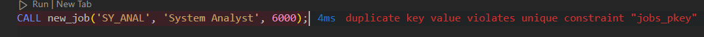
Нарушение primary key, потому что работа с таким ID уже существует.

#### Задание 2
Процедура:
```
CREATE OR REPLACE PROCEDURE add_job_hist(
    p_employee_id INTEGER,
    p_new_job_id VARCHAR(10)
)
LANGUAGE plpgsql
AS $$
DECLARE
    v_hire_date DATE; -- Тут я обозначаю так переменные, префикс v_, чтобы различать их с параметрами и другим
    v_department_id INTEGER;
    v_min_salary INTEGER;
BEGIN
SELECT hire_date, department_id INTO v_hire_date, v_department_id
FROM employees
WHERE employee_id = p_employee_id;

IF NOT FOUND THEN
    RAISE EXCEPTION 'Employee с таким ID не существует.';
END IF;

SELECT min_salary INTO v_min_salary
FROM jobs
WHERE job_id = p_new_job_id;

IF NOT FOUND THEN
    RAISE EXCEPTION 'Job с таким ID не существует.';
END IF;

INSERT INTO job_history (
    employee_id,
    start_date,
    end_date,
    job_id,
    department_id
)
VALUES (
    p_employee_id,
    v_hire_date,
    CURRENT_DATE,
    p_new_job_id,
    v_department_id
);

UPDATE employees
SET
    hire_date = CURRENT_DATE,
    job_id = p_new_job_id,
    salary = v_min_salary + 500
WHERE employee_id = p_employee_id;
EXCEPTION
    WHEN OTHERS THEN
        RAISE NOTICE 'Возникла ошибка: %', SQLERRM;
END;
$$;
```
Затем надо было выключить триггеры, запустить процедуру с employee ID 106 и job ID 'SY_ANAL'
```SELECT * FROM job_history WHERE employee_id = 106;```
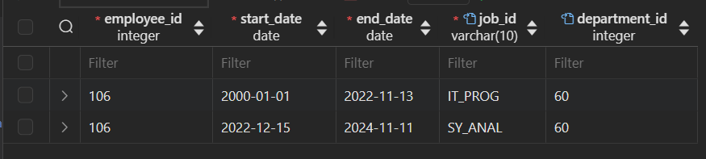
```SELECT * FROM employees WHERE employee_id = 106;```
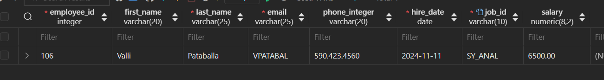
Затем надо было снова включить триггеры.

#### Задание 3
Процедура:
```
CREATE OR REPLACE PROCEDURE upd_jobsal(
    p_job_id VARCHAR(10),
    p_min_salary INTEGER,
    p_max_salary INTEGER
)
LANGUAGE plpgsql
AS $$
BEGIN
    IF p_max_salary < p_min_salary THEN
        RAISE EXCEPTION 'Максимальная зарплата не может быть меньше минимальной.';
    END IF;
    
    UPDATE jobs
    SET min_salary = p_min_salary,
        max_salary = p_max_salary
    WHERE job_id = p_job_id;

    IF NOT FOUND THEN -- Ошибка, если не нашли
        RAISE EXCEPTION 'Job с таким ID не найдена.';
    END IF;

EXCEPTION
    WHEN lock_not_available THEN -- Обработка исключения lock_not_available
        RAISE EXCEPTION 'Таблица заблокирована.';
    WHEN OTHERS THEN -- Обработка всех остальных исключений
        RAISE NOTICE 'Возникла ошибка: %', SQLERRM;
END;
$$;
```
b. Выполните процедуру UPD_JOBSAL, используя идентификатор задания «SY_ANAL», минимальную зарплату 7000 и максимальную зарплату 140.
```CALL upd_jobsal('SY_ANAL', 7000, 140);```
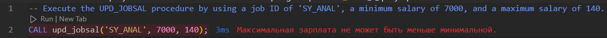
Затем надо было выключить все триггеры.
Выполните процедуру UPD_JOBSAL, используя идентификатор задания «SY_ANAL», минимальную зарплату 7000 и максимальную зарплату 14000.
```CALL upd_jobsal('SY_ANAL', 7000, 14000);```
Все прошло успешно.
-- Query the JOBS table to view your changes, and then commit the changes.
```SELECT * FROM jobs WHERE job_id = 'SY_ANAL';```
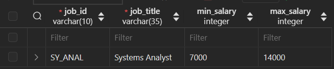
Затем надо было включить триггеры.

#### Задание 4
Функция:
```
CREATE OR REPLACE FUNCTION get_years_service(p_employee_id INTEGER)
RETURNS INTEGER
LANGUAGE plpgsql
AS $$
DECLARE
    v_total_days INTEGER := 0;
    v_current_hire_date DATE;
    v_job_history_days INTEGER;
BEGIN
    SELECT hire_date INTO v_current_hire_date
    FROM employees
    WHERE employee_id = p_employee_id;

    IF NOT FOUND THEN
        RAISE EXCEPTION 'Employee с таким ID не существует.';
    END IF;

    SELECT COALESCE(SUM(end_date - start_date), 0) INTO v_job_history_days -- COALESCE - если нет записей, то вернет 0
    FROM job_history
    WHERE employee_id = p_employee_id;

    v_total_days := v_job_history_days + (CURRENT_DATE - v_current_hire_date); -- Записи работ + количество дней с текущей работы

    RETURN FLOOR(v_total_days / 365);
EXCEPTION
    WHEN OTHERS THEN
        RAISE EXCEPTION 'Возникла ошибка: %', SQLERRM;
        RETURN NULL;
END;
$$;
```
b. Invoke the GET_YEARS_SERVICE function in a call to DBMS_OUTPUT.PUT_LINE for an employee with ID 999.
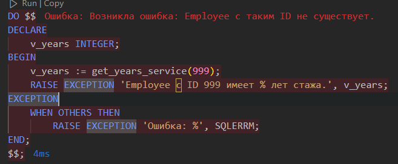
c. Display the number of years of service for employee 106 with DBMS_OUTPUT.PUT_LINE invoking the GET_YEARS_SERVICE function.
Вывод: ```Employee с ID 106 имеет лет стажа: 24.```
d. Query the JOB_HISTORY and EMPLOYEES tables for the specified employee to verify that the modifications are accurate.
```SELECT * FROM job_history WHERE employee_id = 106;```
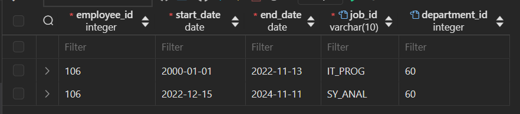
```SELECT * FROM employees WHERE employee_id = 106;```
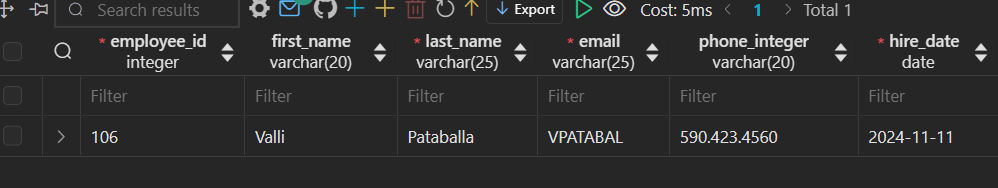

#### Задание 5
Функция:
```
CREATE
OR REPLACE FUNCTION get_job_count (p_employee_id INTEGER) RETURNS INTEGER LANGUAGE plpgsql AS $$
DECLARE
    v_job_count INTEGER;
BEGIN
    IF NOT EXISTS (SELECT 1 FROM employees WHERE employee_id = p_employee_id) THEN
        RAISE EXCEPTION 'Employee с ID % не существует.', p_employee_id;
    END IF;

    SELECT COUNT(*) INTO v_job_count
    FROM (
        SELECT DISTINCT job_id
        FROM job_history
        WHERE employee_id = p_employee_id
        UNION
        SELECT job_id
        FROM employees
        WHERE employee_id = p_employee_id
    ) AS distinct_jobs;

    RETURN v_job_count;
EXCEPTION
    WHEN OTHERS THEN
        RAISE EXCEPTION 'Ошибка: %', SQLERRM; -- Можно было написать RAISE NOTICE
        RETURN NULL;
END;
$$;
```
b. Invoke the function for an employee with ID 176.
```SELECT get_job_count(176) AS years_of_service;```
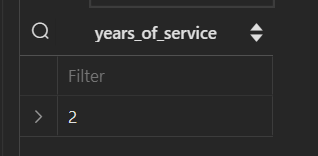

#### Задание 6
Триггер:
```
CREATE OR REPLACE FUNCTION check_sal_range_func()
RETURNS trigger AS $$
BEGIN
IF (NEW.min_salary IS DISTINCT FROM OLD.min_salary) OR
    (NEW.max_salary IS DISTINCT FROM OLD.max_salary) THEN
    IF NEW.min_salary > NEW.max_salary THEN
        RAISE EXCEPTION 'Минимальная зарплата (%) не может быть больше максимальной зарплаты (%) для job с ID %.', NEW.min_salary, NEW.max_salary, NEW.job_id;
    END IF;

    IF EXISTS (
        SELECT 1 FROM employees
        WHERE job_id = NEW.job_id
              AND (salary < NEW.min_salary OR salary > NEW.max_salary)
    ) THEN
        RAISE EXCEPTION 'Нельзя обновить минимальную и максимальную зарплату для job с ID "%", потому что есть employees, у которых зарплата вне данного диапазона (% - %).',
            NEW.job_id, NEW.min_salary, NEW.max_salary;
    END IF;
END IF;

RETURN NEW;
END;
$$ LANGUAGE plpgsql;

CREATE TRIGGER check_sal_range
BEFORE UPDATE OF min_salary, max_salary
ON jobs
FOR EACH ROW
EXECUTE FUNCTION check_sal_range_func();
```
b. Write a query to display the current salary range for the SY_ANAL job ID, and another query to display the employee ID, last name, and salary for the same job ID.
```SELECT job_id, job_title, min_salary, max_salary FROM jobs WHERE job_id = 'SY_ANAL';```
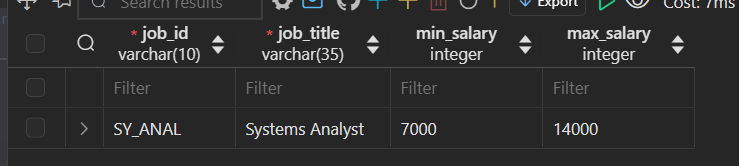
```SELECT employee_id, last_name, salary FROM employees WHERE job_id = 'SY_ANAL';```
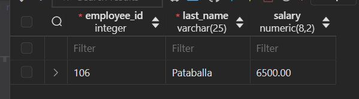
Attempt to update the salary range for SY_ANAL:
```UPDATE jobs SET min_salary = 5000, max_salary = 7000 WHERE job_id = 'SY_ANAL';```
Успешно.
Query to verify the updated salary range for SY_ANAL.
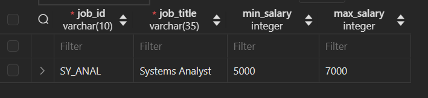
Using the job SY_ANAL, set the new minimum salary to 7000 and the new maximum salary to 18000. Explain the results.
```UPDATE jobs SET min_salary = 7000, max_salary = 18000 WHERE job_id = 'SY_ANAL';```
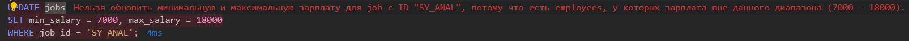
Объяснение: все написано в ошибке.
Если посмотреть в таблицу с employees, то увидим:
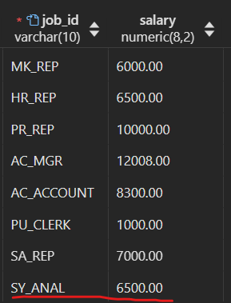
Query to verify the updated salary range for SY_ANAL.
```SELECT job_id, job_title, min_salary, max_salary FROM jobs WHERE job_id = 'SY_ANAL';```
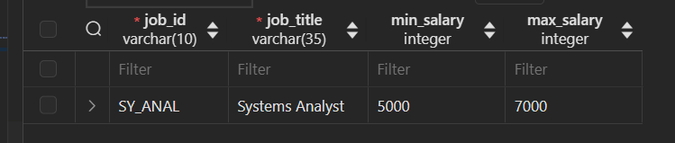
Все правильно, ничего не изменилось из-за ошибки.